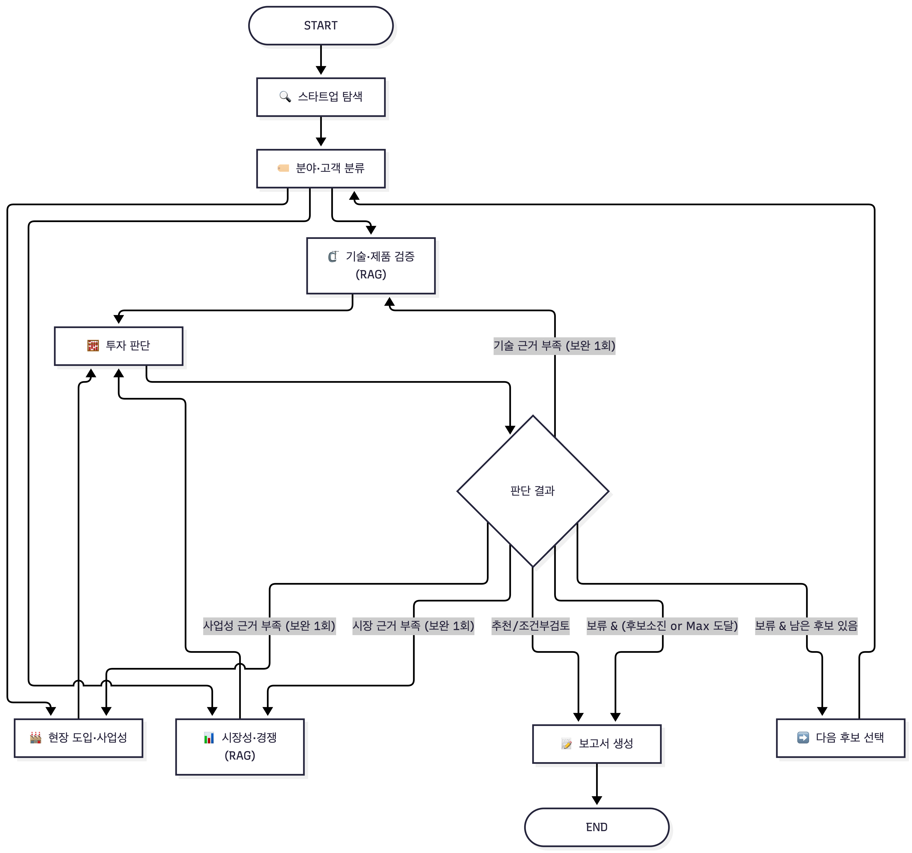
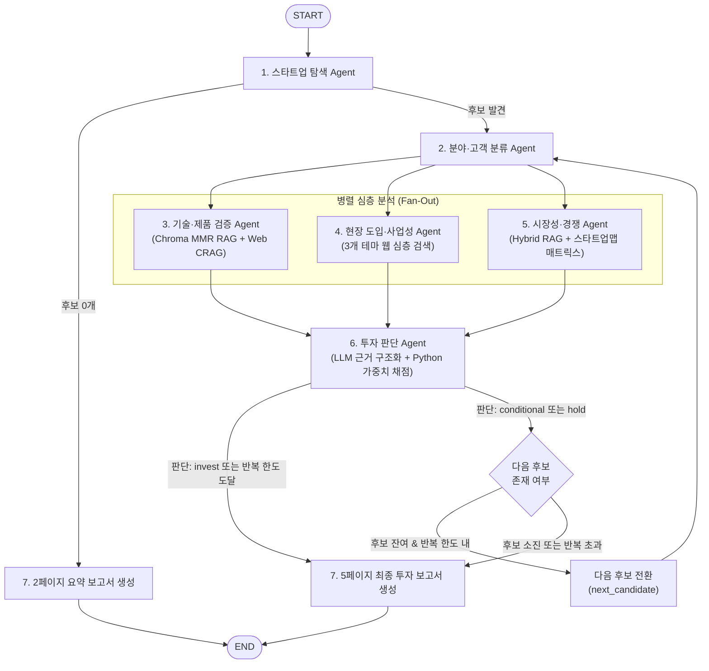
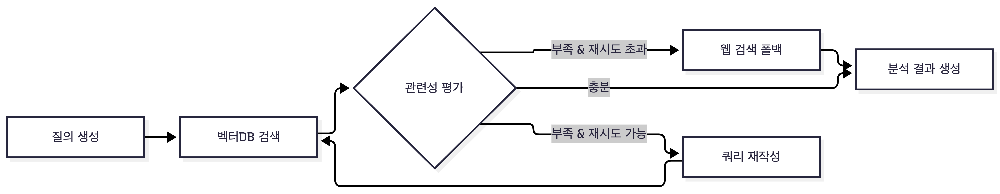

# AI 스타트업 투자 평가 Multi-Agent & Agentic RAG 시스템
> **Physical AI & Robotics 스타트업 발굴, 심층 다각도 분석(기술/사업성/시장), 가중치 기반 투자 심사 및 5페이지 PDF 투자 보고서 자동 생성 파이프라인**

본 프로젝트는 LangGraph 기반의 Multi-Agent 오케스트레이션과 Agentic RAG(CRAG)를 결합하여, Physical AI 및 로보틱스 스타트업의 투자 타당성을 다각도로 검증하고 인간 심사역 수준의 근거 기반 투자 보고서를 자동 생성하는 엔드투엔드(End-to-End) 평가 시스템입니다.

---

## 목차 (Table of Contents)

1. [프로젝트 개요 (Overview)](#1-프로젝트-개요-overview)
2. [시스템 아키텍처 및 워크플로우](#2-시스템-아키텍처-및-워크플로우)
3. [에이전트별 세부 역할 및 구현 명세](#3-에이전트별-세부-역할-및-구현-명세)
4. [RAG 검색 성능 평가 및 최적화 성과](#4-rag-검색-성능-평가-및-최적화-성과)
5. [로컬 환경 구축 및 실행 가이드](#5-로컬-환경-구축-및-실행-가이드)
6. [테스트 및 검증 체계](#6-테스트-및-검증-체계)
7. [프로젝트 한계 및 운영 시 유의사항](#7-프로젝트-한계-및-운영-시-유의사항)
8. [프로젝트 디렉토리 구조](#8-프로젝트-디렉토리-구조)
9. [팀원 역할 및 기여도 (Contributors)](#9-팀원-역할-및-기여도-contributors)

---

## 1. 프로젝트 개요 (Overview)

### 1.1 배경 및 목적
Physical AI 및 로봇 산업은 하드웨어와 AI 소프트웨어가 결합된 고도의 복합 산업입니다. 기술적 실현 가능성(논문/벤치마크), 실제 산업 현장 도입 여부(PoC vs 유료 상용화), 시장 침투율 및 경쟁 강도 등 검토해야 할 정보가 광범위하며, 단순 LLM 생성에만 의존할 경우 심각한 환각(Hallucination)이 발생합니다.

본 시스템은 **출처 기반 구조화 분석(Fact-grounded Analysis)**과 **결정론적 검증(Deterministic Verification)**을 결합하여, 공개 웹 정보와 산업·학술 문헌 DB를 바탕으로 투자 적합성을 평가하고 감사 가능한(Auditable) PDF 보고서를 생성합니다.

### 1.2 핵심 평가 기준 및 가중치
실제 벤처캐피털(VC) 심사역의 평가 프레임워크를 기반으로 6개 핵심 평가 영역과 가중치를 설정했습니다.

| 평가 항목 | 가중치 | 주요 평가 내용 |
|---|:---:|---|
| **창업자·팀 (Team)** | **30%** | 핵심 창업진의 Physical AI/로보틱스 전문성, 이전 창업 및 상용화 실행 성과 |
| **시장성 (Market)** | **25%** | TAM/SAM/SOM 시장 규모, 전방 산업 수요, 연평균 성장률(CAGR) |
| **제품·기술력 (Technology)** | **15%** | 로봇 VLA/월드모델 아키텍처, 벤치마크 대비 실제 구현 및 자체 기술 차별성 |
| **경쟁 우위 (Competition)** | **10%** | 스타트업맵 분야 내 경쟁 구도, 진입 장벽(특허, 데이터, 하드웨어 수직계열화) |
| **실적·트랙션 (Traction)** | **10%** | 단순 시연이 아닌 실제 유료 고객 계약, PoC 전환율, 현장 도입 대수 |
| **투자 조건 (Terms)** | **10%** | 누적 투자 유치액, 밸류에이션, 지분 구조, 투자 라운드 조건 |

### 1.3 투자 판단 3단계 의사결정 규칙
1. **`invest` (투자 추천)**: 가중합 **4.0점 이상**. 즉시 5페이지 심층 투자 보고서를 생성하고 파이프라인을 종료합니다.
2. **`conditional` (조건부 검토)**: 가중합 **3.0점 이상 4.0점 미만**. 핵심 보완 사항을 기록하고 다음 후보 스타트업을 순차 검토합니다.
3. **`hold` (투자 보류)**: 가중합 **3.0점 미만**. 보류 사유를 기록하고 다음 후보 스타트업을 검토합니다.
4. **강제 보류 안전장치 (Safety Gates)**:
   - 핵심 데이터 부재 시: 공개 자료로 투자 조건 등이 확인되지 않으면 임의 점수(3점 등)를 부여하지 않고 해당 점수를 `None` 처리하며 **즉시 `hold`**로 강제 분기합니다.
   - 중대 위험 식별 시: 인증 미비, 심각한 안전/법률 규제 이슈가 확인된 경우 총점과 관계없이 **무조건 `hold`**로 판정합니다.

---

## 2. 시스템 아키텍처 및 워크플로우

### 2.1 전체 시스템 아키텍처



### 2.2 LangGraph 기반 실행 흐름 (Workflow)
파이프라인은 탐색 → 분류 → 3개 병렬 분석(기술/사업성/시장) → 투자 판단 → 조건부 분기(보고서 생성 or 다음 후보 루프) 순서로 동작합니다.



### 2.3 Agentic RAG 서브그래프 (CRAG)
기술 검증 및 시장 분석 노드는 신뢰할 수 없는 정보의 전파를 차단하기 위해 Self-Corrective RAG(CRAG) 패턴을 적용했습니다.



### 2.4 State 관리 및 Basecode 계약 (Isolation & Reducer)
- **노드별 State 쓰기 격리 (`contracts.py`)**: `guard_node` 데코레이터를 통해 각 에이전트가 사전 정의된 State 키만 수정할 수 있도록 엄격히 제한합니다 (예: 4번 사업성 에이전트는 `business_analysis`와 `references`만 수정 가능).
- **불변성 및 Reducer 병합**: 병렬 실행되는 에이전트들의 출처 충돌을 방지하기 위해 `references`(인용 근거 Evidence)와 `evaluations`(기업별 평가 이력)만 LangGraph의 Reducer를 통해 누적 병합(append)됩니다.

---

## 3. 에이전트별 세부 역할 및 구현 명세

### 1) 스타트업 탐색 Agent (`agents/discovery.py`, `discover.py`)
- **담당자**: 윤도균
- **입력**: `domain` (도메인, 기본: Physical AI/Robotics), `criteria` (`region`, `funding_stages`, `candidate_limit`)
- **출력 State**: `candidates`, `current_idx`, `selected_startup`, `references`
- **핵심 메커니즘**:
  - Tavily 기반 영문/국문 쿼리로 도메인 적합 스타트업 후보를 다수 발굴합니다.
  - 기업별 추가 검색을 통해 **비상장 여부, Exit(상장/M&A) 미완료, 적격 투자 단계(Seed ~ Series C)**를 출처 기반으로 상호 검증합니다.
  - 질의당 최대 2회 재시도, 제안 검증 상한 `min(candidate_limit * 2, 20)` 및 검색 호출 상한(`2 + 2 * limit*2`)을 두어 API 비용 폭증을 방지합니다.
  - LLM이 인용한 모든 출처 ID가 실제 검색 결과에 존재하는지 검사하며, 후보가 없을 경우 빈 후보 목록을 반환하여 2페이지 보고서로 안전하게 유도합니다.

### 2) 분야·고객 분류 Agent (`agents/profile.py`)
- **담당자**: 배은빈
- **입력**: `selected_startup` (기업명, 제품명, 투자 단계, 팀 정보)
- **출력 State**: `profile` (`subdomain`, `paying_customer`, `customer_problem`, `info_sufficiency`, `missing_info`)
- **핵심 메커니즘**:
  - 스타트업을 8개 공식 세부 분야(`휴머노이드`, `산업용·제조 로봇`, `물류 로봇`, `자율주행·모빌리티`, `서비스 로봇`, `로봇 AI 소프트웨어`, `로봇 부품·하드웨어`, `기타`)로 분류합니다.
  - **지불자(Payer)와 실사용자(User)를 분리**: 제품 비용을 실제로 지불하는 고객(예: 물류센터 운영사, 자동차 제조 공장)과 해결하고자 하는 핵심 문제를 정의합니다.
  - **환각 차단 로직**: 제품 정보가 없거나 공백인 경우 LLM을 아예 호출하지 않고 즉시 `subdomain: 기타`, `info_sufficiency: 부족`, `missing_info: ["제품 설명"]`을 반환하여 불필요한 추정을 차단합니다.

### 3) 기술·제품 검증 Agent (`agents/technical.py`, `scripts/ingest_tech_docs.py`)
- **담당자**: 박주윤
- **입력**: `selected_startup`, `profile`, Chroma `tech_docs` 컬렉션
- **출력 State**: `technical_analysis`, `references`
- **핵심 메커니즘**:
  - **학술·산업 RAG DB**: 최신 VLA 파운데이션 모델 논문 2편(LingBot-VLA, τ0-VLA) 및 SPRi 피지컬 AI 연구보고서(총 30p, 157개 청크)를 로컬 Chroma에 구축.
  - **MMR 기반 검색**: 다양성 확보를 위해 MMR(Maximal Marginal Relevance, `top_k=5`, `fetch_k=20`, `lambda_mult=0.5`)을 적용.
  - **CRAG 분기 규칙**: LLM이 검색된 문헌의 관련성을 평가하고, 문헌이 부족하거나 **기업 고유 자료가 없는 경우** Tavily 웹 검색으로 자동 폴백(Fallback, 2회)하여 최신 기업 기술 정보를 확보합니다.
  - **환각 방지 핵심 장치**: 논문 속 벤치마크 모델 성능과 실제 기업 제품 성능이 뒤섞이지 않도록 출력 모델을 `performance_evidence`(기업 실측 근거)와 `benchmark_context`(업계 벤치마크 문맥)로 명격히 분리했습니다.

### 4) 현장 도입·사업성 Agent (`agents/business.py`, `business_search.py`, `business_models.py`, `business_analysis.py`)
- **담당자**: 배영환
- **입력**: `selected_startup`, `profile`
- **출력 State**: `business_analysis`, `references`
- **핵심 메커니즘**:
  - **3대 테마 집중 검색**: 1) 고객·상용화(`customer deployment paid contract pilot`), 2) 비용·효과(`pricing maintenance ROI case study`), 3) 안전·규제(`safety certification`) 주제별 각 1회 총 3회 검색 수행.
  - **상용화 4단계 엄격 분류**:
    - `paid_operation`: 실제 대금을 수취하는 고객 상용 운영 사례(`is_paid=True`)가 확인된 경우에만 한정.
    - `pilot`: 유료 PoC, 시험 운영, 기술 실증 단계.
    - `demo`: 단순 전시회 시연, 기술 프로토타입 공개, MOU 체결.
    - `unknown`: 운영 근거 부족.
  - **수치 무결성 검증**: 도입 비용(구매/구독/유지보수) 및 정량적 경제 효과(ROI, 생산성 향상률)에 대해 확인되지 않은 수치는 지어내지 않고 `null` 및 미공개로 기록합니다.

### 5) 시장성·경쟁 Agent (`agents/market.py`, `crag.py`)
- **담당자**: 이경민
- **입력**: `selected_startup`, `profile`, Chroma `market_docs` 컬렉션
- **출력 State**: `market_analysis`, `references`
- **핵심 메커니즘**:
  - **하이브리드 RAG**: BM25(가중치 0.4) + Dense Chroma Similarity(가중치 0.6) 결합, 섹션 경계(`SEPARATORS`) 청킹 적용(1,000자, 오버랩 150자).
  - **결정론적 경쟁사 선정 (Deterministic Matrix Matching)**:
    - 스타트업얼라이언스 스타트업맵 매트릭스에서 코드가 직접 타깃 분야의 경쟁사를 1차 필터링하고, 본문 출현 문장을 추출(`evidence_sentences`).
    - LLM은 코드가 추출해 준 문장 범위 내에서만 경쟁사 상세 요약을 작성하므로, **동일 입력 시 3회 실행 3회 100% 동일한 경쟁사 분석 결과 보장** (기존 6회 실행 시 6가지 다른 경쟁사가 나오던 LLM 비결정성 문제 완벽 해결).
  - **코드 레벨 사후 정제 (`validation`)**:
    - 인용 없는 항목 자동 제거 (`dropped_uncited_items`)
    - 출처 없는 수치/낮은 등급 출처 수치 제거 (`unverified_figures`, `low_tier_figures`)
    - 1.5배 이상 상충 수치 발생 시 고등급 출처 우선 채택 (`conflicting_figures`)
    - 평가 대상 기업이 경쟁사 목록에 스스로 포함되는 오류 방지 (`excluded_self_as_competitor`)

### 6) 투자 판단 Agent (`agents/decision.py`, `decision_models.py`, `scoring.py`)
- **담당자**: 배영환
- **입력**: `selected_startup`, `profile`, `technical_analysis`, `business_analysis`, `market_analysis`, `references`
- **출력 State**: `scores`, `investment_score`, `decision`, `decision_reason`, `evaluations`
- **핵심 메커니즘**:
  - **LLM + Python 하이브리드 심사**:
    - LLM: 6대 항목에 대해 1~5점 정수 점수와 4단계 논리 근거(확인 사실 → 평가 기준 적용 → 해당 점수 부여 이유 → 한계 및 부족 정보)를 작성하고 실제 출처 ID 매핑.
    - Python (`calculate_score`): 출처 ID 유효성, 점수 범위, boolean/문자열 등 타입 이상을 검증한 뒤 반올림 전 실수 가중합과 최종 판단 산출.
  - **보수적 심사 게이트**:
    - 투자 조건(밸류에이션, 지분 등) 미공개 시 1점이나 3점을 임의로 채우지 않고 `None` 처리하며 **자동 `hold` 판정**.
    - 출처로 입증된 중대 법률·안전 위험 존재 시 점수와 무관하게 **강제 `hold`**.

### 7) 보고서 생성 Agent (`agents/report.py`)
- **담당자**: 윤도균
- **입력**: GraphState 전체
- **출력 State**: `report` (생성된 PDF 파일의 절대 경로)
- **핵심 메커니즘**:
  - ReportLab을 사용하여 표준 5페이지 PDF 투자 심사 보고서 생성:
    - **Page 1 (SUMMARY)**: 대상 기업, 최종 투자 판단 및 종합 점수, 핵심 강점/위험 요약
    - **Page 2 (기업 및 사업 개요)**: 제품 설명, 고객 문제, 상용화 단계, 고객 도입 사례
    - **Page 3 (기술 및 시장 분석)**: VLA/Physical AI 핵심 기술 검증, 시장 규모 및 성장률, 경쟁 구도
    - **Page 4 (투자 평가 및 최종 의견)**: 6대 항목 점수표, 평가 이력(최대 10개), 실사 질문 리스트
    - **Page 5 (REFERENCE)**: 보고서 본문 및 판단 근거에서 실제로 인용된 출처만 선별 기재
  - **원자적 검증 (Atomic Validation)**: 임시 파일에 PDF를 먼저 생성한 후, PyMuPDF(`fitz`)로 페이지 수(정확히 5페이지)와 헤더 텍스트를 검증한 뒤 `output/pdf/`로 최종 이동.
  - **후보 0개 폴백**: 탐색된 후보가 없는 경우 불필요한 LLM 호출 없이 SUMMARY와 REFERENCE로 구성된 2페이지 안내 PDF를 즉시 생성.

---

## 4. RAG 검색 성능 평가 및 최적화 성과

시장 문서(`market_docs`)를 대상으로 질문-답변 평가 세트(한국어 20개, 영어 10개)를 구축하고 검색 파이프라인의 검색 성능을 객관적으로 측정 및 최적화했습니다 (`docs/MARKET_RETRIEVAL_EVAL.md`).

### 4.1 Retriever 방식별 검색 정확도 비교

| Retriever 구성 | ko Recall@5 | en Recall@5 | **전체 Recall@5 (Content)** | 전체 MRR@5 | Page 기준 Recall@5 |
|---|:---:|:---:|:---:|:---:|:---:|
| BM25 단독 | 0.650 | 0.200 | 0.500 | 0.344 | 0.567 |
| KURE-v1 Dense MMR (초기) | 0.600 | 0.700 | 0.633 | 0.569 | 0.867 |
| KURE-v1 Dense Similarity | 0.900 | 0.800 | 0.867 | 0.676 | 0.900 |
| **KURE-v1 Hybrid (최종 운영)** | **0.900** | **0.800** | **0.867** | **0.671** | **0.900** |
| BGE-M3 Hybrid | 0.850 | 0.800 | 0.833 | 0.612 | 0.833 |
| Multilingual-E5-Large Hybrid | 0.900 | 0.400 | 0.733 | 0.572 | 0.733 |

### 4.2 주요 최적화 내용
1. **Dense MMR → Similarity 전환 (Recall@5 0.633 → 0.833)**: MMR의 다양성 페널티(`lambda_mult=0.5`)가 정답 청크 대신 같은 페이지의 덜 관련된 청크를 상위로 끌어올리는 문제를 확인하고, 유사도 순 정렬로 변경하여 대폭 개선.
2. **섹션 경계 청킹 도입 (Recall@5 0.833 → 0.867)**: 단순 글자 수 분할 시 Markdown 제목(`##`, `###`)이 본문과 섞여 문맥이 오염되던 현상을 해결하기 위해 섹션 경계 우선 분할기 적용.
3. **임베딩 모델 선정**: KURE-v1, BGE-M3, E5-Large 비교 시 KURE-v1이 한국어 및 한/영 교차 검색에서 가장 안정적인 성능을 기록하여 최종 채택.
4. **실제 도메인 질문 5종 검증 결과**:
   - "휴머노이드 시장 성장률은?" → **1위 적중** (SPRi p.17)
   - "2024년 전 세계 산업용 로봇 설치 대수는?" → **1위 적중** (IFR p.8)
   - "한국의 제조업 로봇 밀도는?" → **1위 적중** (스타트업맵 p.7)
   - "국내 물류 자율주행 로봇 스타트업은?" → **2위 적중** (스타트업맵 p.8)
   - "서비스 로봇 중 가장 많이 설치된 용도는?" → **3위 적중** (IFR p.29)
   - **결과: 5개 문항 모두 Top-3 이내 완벽 검색 달성**

---

## 5. 로컬 환경 구축 및 실행 가이드

### 5.1 사전 준비 및 환경 설정

Python 3.11 환경을 권장합니다.

```bash
# 1. 저장소 클론 및 이동
git clone https://github.com/songjung-good/ai_analysis.git
cd ai_analysis

# 2. 가상환경 생성 (uv 또는 python venv)
python3.11 -m venv .venv
source .venv/bin/activate

# 3. 의존성 패키지 설치
pip install -r requirements.txt
```

### 5.2 환경변수 설정 (`.env`)
`.env.example`을 복사하여 `.env`를 생성하고 필수 API 키를 입력합니다.

```bash
cp .env.example .env
```

`.env` 설정 예시:
```dotenv
OPENAI_API_KEY=sk-proj-...
OPENAI_MODEL=gpt-4o-mini                 # 또는 gpt-4o (구조화 출력 지원 모델)
TAVILY_API_KEY=tvly-...
CHROMA_PERSIST_DIRECTORY=data/chroma
OPENAI_REASONING_EFFORT=low              # 선택 (시장 에이전트 reasoning 모델용)

# (선택) 한글 PDF 렌더링 폰트 (Linux/Windows 환경에서 한글 깨짐 발생 시 지정)
# macOS는 시스템 AppleGothic이 자동 감지됩니다.
# REPORT_FONT_PATH=/usr/share/fonts/truetype/nanum/NanumGothic.ttf
```

### 5.3 RAG 벡터 데이터베이스 적재 (필수 1회)

#### 1) 기술 문서 적재 (`tech_docs`)
`data/tech_docs/manifest.json`에 명시된 VLA 논문 및 연구보고서 PDF를 청킹하여 로컬 Chroma에 저장합니다.

```bash
# 분할 및 페이지 확인 (Dry Run)
PYTHONPATH=src python scripts/ingest_tech_docs.py --dry-run

# 실제 적재 실행
PYTHONPATH=src python scripts/ingest_tech_docs.py
```

#### 2) 시장 문서 적재 (`market_docs`)
시장 문서는 `data/market/sources.json`에 명시된 원본 PDF 파일이 `data/market/raw/` 폴더에 위치해야 합니다.
- `startupalliance_2026_physical_ai_startup_map.pdf`
- `spri_is202_physical_ai_status.pdf`
- `ifr_world_robotics_2025_press.pdf`

파일 준비 후 적재 명령을 실행합니다:
```bash
PYTHONPATH=src python -m ai_investment.ingest market
```

### 5.4 실행 방법

#### 1) 전체 Multi-Agent 파이프라인 실행
탐색부터 최종 보고서 생성까지 전체 파이프라인을 구동합니다.

```bash
python app.py --domain "Physical AI/Robotics" --region "대한민국" --limit 3 --max-iterations 3
```
- 실행 완료 시 `output/pdf/` 디렉토리에 5페이지 투자 보고서 PDF가 생성됩니다.

#### 2) 1번 스타트업 탐색 단독 CLI 실행
전체 평가 없이 관심 분야의 스타트업 후보만 빠르게 발굴 및 검증하고자 할 때 사용합니다.

```bash
PYTHONPATH=src python -m ai_investment.discover --region 대한민국 --limit 3
```

#### 3) 4번 사업성 분석 실제 기업 API 예제 실행
Tavily 실검색과 LLM 구조화 분석을 통한 상용화/도입 분석 예제를 실행합니다.

```bash
python examples/run_business_agent.py
```
- 결과는 `outputs/agility_business_*.json`에 저장됩니다.

#### 4) RAG 검색 성능 자동 평가 실행
```bash
# KURE-v1 임베딩 기반 검색 평가 지표 산출
PYTHONPATH=src python -m ai_investment.retrieval_eval score market --models kure

# 도메인 대표 질문 5종 정성적 검색 순위 채점
PYTHONPATH=src python -m ai_investment.retrieval_eval qualitative market
```

---

## 6. 테스트 및 검증 체계

본 프로젝트는 외부 API 호출 없이 로컬에서 신속하고 격리된 상태로 전체 로직을 검증할 수 있도록 Mocking 및 Stub 기반의 단위/통합 테스트 스위트를 구축했습니다.

### 테스트 실행
```bash
PYTHONPATH=src python -m unittest discover -s tests -v
```

### 테스트 현황 (총 145개)
- **141개 테스트 통과 (Pass)**
- **4개 테스트 생략 (Skipped)**: 실제 외부 OpenAI/Tavily API를 호출하는 기술 스모크 테스트(`RUN_LIVE_TESTS=1` 설정 시 실행)
- **실패 및 오류: 0건**

### 주요 테스트 영역
- `test_basecode.py`: 에이전트 간 State 충돌 방지 가드(`guard_node`) 및 불변성 검증
- `test_discovery.py`: 후보 탐색, 기업별 검증, 출처 ID 누락 검증, 검색 한도 제어
- `test_profile.py`: 8개 세부 분야 분류 및 제품 미제공 시 LLM 호출 생략 검증
- `test_technical.py`: CRAG 분기 로직, 벤치마크 vs 기업 성능 분리 검증
- `test_business_*.py`: 상용화 4단계 판별, 유료 PoC vs 상용 운영 구분, 수치 유효성 검증
- `test_market.py`: 하이브리드 RAG, 결정론적 경쟁사 선정, 출처 없는 수치 코드 레벨 제거 검증
- `test_decision.py`: 6대 항목 가중합 산출, 미공개 정보 `None` 처리, 중대 위험 강제 보류 검증
- `test_report.py`: ReportLab 5페이지 및 2페이지 레이아웃, PyMuPDF 페이지/헤더 무결성 검증

---

## 7. 프로젝트 한계 및 운영 시 유의사항

코드 리뷰(`review.md`) 및 실데이터 검증 과정에서 도출된 한계와 실무 운영 시 유의점입니다.

1. **6번 판단 근거와 7번 SUMMARY 길이 제약**:
   - 6번 투자 판단 에이전트가 6개 항목 전체의 장문 근거를 `decision_reason`에 모두 담아 전달할 경우, 7번 보고서의 `SUMMARY` 반 페이지 분량 제한에 걸려 PDF 렌더링 예외가 발생할 수 있습니다. 운영 시에는 핵심 이유 요약(2~3문장)만 SUMMARY에 전달하고 상세 근거는 4페이지(투자 평가)로 분리해야 합니다.
2. **시장 원본 PDF 데이터 준비**:
   - 저작권 및 대용량 파일 관리 목적으로 `data/market/raw/`의 원본 PDF는 Git에 포함되지 않습니다. 시장 RAG를 사용하려면 안내된 3개 PDF를 수동으로 배치해야 합니다.
3. **출처 ID 검증과 의미적 사실성의 차이**:
   - 현재 시스템은 LLM이 인용한 출처 ID가 실제 검색 결과에 존재하는지(Existence)를 코드로 100% 검증하지만, 해당 발췌문이 주장을 진실되게 뒷받침하는지(Semantic validity)는 LLM 및 심사역의 최종 검토가 필요합니다.
4. **공개 정보 부족에 따른 보수적 심사**:
   - 비상장 스타트업의 특성상 투자 조건(기업가치, 지분율 등)이 웹상에 공개되지 않는 경우가 많습니다. 본 시스템은 임의의 추정 점수를 주지 않고 안전하게 `None` 처리 후 `hold`로 판정하므로, 실제 투자 심사 시에는 실사 자료를 직접 입력할 수 있는 보완 입력 인터페이스가 권장됩니다.
5. **순차적 첫 추천 종료 방식**:
   - 본 시스템은 전체 후보를 상대 평가하여 1위를 뽑는 구조가 아니라, 후보 리스트를 순서대로 검토하다가 **첫 번째 `invest` 적격 기업을 찾으면 심층 보고서를 작성하고 종료**하는 파이프라인입니다. 모든 후보 간의 종합 비교 매트릭스를 도출하려면 전체 후보 평가 모드로의 확장이 필요합니다.

---

## 8. 프로젝트 디렉토리 구조

```text
ai_analysis/
├── data/                         # RAG 원문 및 메타데이터
│   ├── tech_docs/                # 기술 RAG 원문 PDF 3개 및 manifest.json
│   └── market/                   # 시장 RAG manifest, 텍스트 전사본, 평가 질문셋
├── scripts/                      # 데이터베이스 적재 스크립트
│   └── ingest_tech_docs.py       # 기술 PDF -> Chroma tech_docs 컬렉션 적재
├── src/ai_investment/            # 메인 소스코드 패키지
│   ├── agents/                   # 7개 에이전트 핵심 구현부
│   │   ├── discovery.py          # 1. 스타트업 탐색 Agent
│   │   ├── profile.py            # 2. 분야·고객 분류 Agent
│   │   ├── technical.py          # 3. 기술·제품 검증 Agent
│   │   ├── business.py           # 4. 현장 도입·사업성 Agent
│   │   ├── business_search.py    #    - 3대 테마 검색 계획 수립
│   │   ├── business_models.py    #    - Pydantic 입출력 데이터 모델
│   │   ├── business_analysis.py  #    - LLM 구조화 분석 및 인용 검증
│   │   ├── market.py             # 5. 시장성·경쟁 Agent
│   │   ├── decision.py           # 6. 투자 판단 Agent
│   │   ├── decision_models.py    #    - 6대 항목 점수/근거 모델
│   │   └── report.py             # 7. 보고서 생성 Agent (PDF)
│   ├── tools/                    # 공용 도구 모음 (RAG, Web Search)
│   │   ├── rag.py                # KURE-v1 임베딩, Chroma, MMR/하이브리드 검색기
│   │   ├── web.py                # Tavily 웹 검색 연동 및 Evidence 변환
│   │   └── common.py             # 출처 ID 생성 및 데이터 가공
│   ├── contracts.py              # 노드별 State 쓰기 권한 격리 (guard_node)
│   ├── crag.py                   # 시장 CRAG 서브그래프 구현체
│   ├── control.py                # 후보 순환 루프 및 조기 종료 라우팅
│   ├── discover.py               # 1번 탐색 단독 실행 CLI
│   ├── graph.py                  # LangGraph Multi-Agent 그래프 빌더
│   ├── ingest.py                 # 시장/공용 문서 전처리 및 Chroma 적재
│   ├── models.py                 # Evidence 공통 출처 모델
│   ├── retrieval_eval.py         # RAG 검색 성능(Recall@5, MRR) 자동 평가기
│   ├── scoring.py                # Python 기반 가중합 계산 및 결정 엔진
│   └── state.py                  # 공유 GraphState 및 Startup 스키마
├── docs/                         # 에이전트별 작업 계획 및 기술 상세 문서
├── examples/                     # 에이전트 단독 실행 예제 스크립트
├── tests/                        # 145개 단위 및 통합 테스트 스위트
├── app.py                        # 전체 Multi-Agent 파이프라인 로컬 실행 엔트리포인트
├── requirements.txt              # 프로젝트 의존성 목록
└── README.md                     # 프로젝트 종합 기술 문서
```

---

## 9. 팀원 역할 및 기여도 (Contributors)

| 이름 | 담당 역할 | 세부 구현 및 기여 내역 |
|:---:|---|---|
| **박주윤** | **기술·제품 검증 Agent (3번)** | - 최신 arXiv VLA 논문 2편 및 SPRi 연구보고서 기반 `tech_docs` RAG DB 구축<br/>- MMR(top_k=5, fetch=20, lambda=0.5) 기반 검색 파이프라인 개발<br/>- 기업 고유 자료 부재 시 웹 검색으로 폴백하는 CRAG 구현<br/>- 벤치마크 문맥과 기업 제품 성능 분리를 통한 환각 방지 설계 |
| **배영환** | **현장 도입·사업성 Agent (4번)<br/>투자 판단 Agent (6번)** | - 3대 테마(고객상용화, 비용효과, 안전규제) 타깃 검색 전략 및 중복 병합 구현<br/>- 상용화 4단계 판별 및 유료 운영(`is_paid=True`) 실증 규칙 정립<br/>- 6대 항목 가중합 산출 및 Python 기반 결정론적 투자 채점 엔진 구현<br/>- 미공개 정보 `None` 처리 및 중대 규제 위험 시 강제 `hold` 안전 게이트 설계 |
| **배은빈** | **분야·고객 분류 Agent (2번)** | - 8개 세부 분야 표준 분류 체계 및 Pydantic `CustomerProfile` 모델 정의<br/>- 비용 지불자(Payer)와 실사용자(User) 분리 정의 및 고객 해결 문제 도출<br/>- 제품 미제공 입력 시 LLM 호출 생략 및 '정보 부족' 즉시 반환 로직 구현<br/>- 분류 에이전트 단위 테스트 8종 작성 및 모순 방지 검증 |
| **윤도균** | **스타트업 탐색 Agent (1번)<br/>보고서 생성 Agent (7번)** | - 웹 검색 기반 후보 발굴, 비상장/Exit미완료/투자단계 3중 검증 로직 구현<br/>- 탐색 단독 CLI(`ai_investment.discover`) 및 검색 호출 상한 안전장치 구현<br/>- ReportLab 기반 5페이지 PDF 및 후보 부재 시 2페이지 폴백 보고서 렌더링<br/>- PyMuPDF를 활용한 페이지 수/헤더 원자적 사전 검증 메커니즘 구축 |
| **이경민** | **시장성·경쟁 Agent (5번)** | - BM25 + Dense similarity 하이브리드 RAG 및 섹션 경계 분할(Recall@5 0.867 달성)<br/>- 스타트업맵 매트릭스 기반 결정론적 경쟁사 선정 로직 개발 (재현율 100%)<br/>- 수치·경쟁사 인용 불일치 및 자체 포함 방지 코드 레벨 사후 정제(`validation`) 구현<br/>- RAG 검색 성능 자동 평가 스크립트(`retrieval_eval.py`) 및 벤치마크 리포트 작성 |
