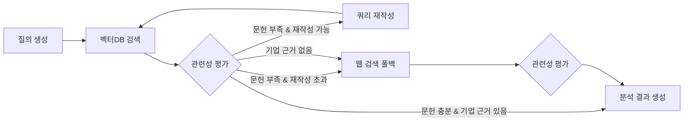

# 기술·제품 검증 Agent 작업 내용

| 항목 | 내용 |
|---|---|
| 담당 | 박주윤 |
| 담당 파트 | 3) 기술·제품 검증 Agent (설계서 B-1, B-2, D-2) |
| 작업 브랜치 | `technical_analysis` |
| 구현 파일 | `src/ai_investment/agents/technical.py` |

## 1. 담당 범위

설계서 B-1의 3번 Agent로, 선정된 스타트업의 AI 인식·판단·행동 기능과 기술 차별성을 논문·기술 보고서 근거로 검증한다.

| 구분 | 설계서 정의 | 구현 |
|---|---|---|
| 입력 | 선정 기업, 기술 문서·논문 | `selected_startup`, `profile`, `tech_docs` collection |
| 출력 | 핵심 기술, 성능 근거, 기술적 한계, 출처 | `technical_analysis`, `references` |
| 도구 | 벡터DB 검색, 관련성 평가, 웹 검색(fall-back) | `search_tech_docs`, `grade_relevance`, `web_search` |
| RAG | O | CRAG 흐름으로 구현 |

## 2. 작업 파일

| 파일 | 구분 | 내용 |
|---|---|---|
| `src/ai_investment/agents/technical.py` | 수정 | Agent 본체 (스텁 → CRAG 구현) |
| `scripts/ingest_tech_docs.py` | 신규 | PDF를 `tech_docs` collection에 적재 |
| `data/tech_docs/` | 신규 | RAG 원문 PDF 3개 + `manifest.json` |
| `tests/test_technical.py` | 신규 | 단위 테스트 9개 + 실제 API 스모크 테스트 4개 |
| `.gitignore` | 수정 | `data/chroma/` 추가 (로컬 벡터DB는 커밋 제외) |

## 3. RAG 데이터

설계서 B-2 기준(arXiv 로봇 파운데이션 모델·VLA 논문 2~3편 + SPRi 기술 파트, 약 70p 이내)에 맞춰 구성했다.

| 문서 | 사용 페이지 | 쪽수 | 용도 |
|---|---|---:|---|
| SPRi「피지컬 AI의 현황과 시사점」(IS-202, 2025.05.13) | PDF 8–15, 37–38 | 10 | 주요 기술(두뇌·감각·연결·행동), 유형 분류, 기술적 한계·비용 |
| A Pragmatic VLA Foundation Model (LingBot-VLA, arXiv 2601.18692) | 1–9 (본문) | 9 | VLA 성능 근거, 실제 로봇 벤치마크(GM-100) |
| τ0-VLA (arXiv 2608.16885) | 1–11 (본문) | 11 | 계층형 VLA, 월드 모델, 장기 과제 수행 |
| **합계** | | **30** | 청크 157개 |

- 페이지 범위는 `data/tech_docs/manifest.json`의 `pages`로 관리한다. SPRi는 본문 쪽번호보다 PDF 쪽번호가 5 크다.
- References·Appendix는 검색 잡음을 줄이기 위해 제외했다.
- 두 논문은 arXiv 프리프린트이므로 보고서 인용 시 프리프린트임을 표기한다.

## 4. RAG 구성

| 항목 | 설정 | 비고 |
|---|---|---|
| Document Loader | `PyMuPDFLoader` | |
| Text Splitter | `RecursiveCharacterTextSplitter` | chunk_size=800, chunk_overlap=100 |
| Embedding | `nlpai-lab/KURE-v1` | 공용 `tools/rag.py` 사용 |
| Vector Store | Chroma, collection `tech_docs` | `data/chroma/`에 로컬 영속 저장 |
| Retriever | MMR | top_k=5, fetch_k=20, lambda_mult=0.5 |
| 청크 ID | `tech:{파일명}:p{쪽}:c{순번}` | REFERENCE 연결과 문헌 출처 판별에 사용 |

## 5. 처리 흐름 (CRAG)



- 질의 생성: 기술 개념 중심으로 한국어·영어 질의 3개를 만든다. 질의 하나에 개념 하나, 20단어 이내 자연어 문장.
- 관련성 평가: LLM이 검색 결과마다 관련 여부, 근거 충분성, 기업 고유 자료 여부(`company_specific`)를 판정한다.
- 쿼리 재작성: 최대 1회. 동의어와 영문 기술 용어를 섞어 다시 검색한다.
- 웹 검색 폴백: 기업명·제품명으로 Tavily 검색 2회. 결과도 관련성 평가를 거친다.

### 설계서 대비 변경 사항

| 항목 | 설계서 | 구현 | 이유 |
|---|---|---|---|
| 웹 폴백 조건 | 문헌 관련성 부족 시 | 문헌 부족 **또는 기업 고유 자료가 없을 때** | `tech_docs`는 업계 일반 문헌이라 특정 기업을 검증할 근거가 없음. 이 조건이 없으면 논문만 보고 기업 기술을 평가하게 됨 (스모크 테스트로 확인) |
| 서브그래프 형태 | LangGraph 서브그래프 | Agent 내부 루프 | BASECODE 규칙 "재시도와 fallback은 Agent 내부에서 끝낸다"에 맞춤. 단계 구성은 그림과 동일 |
| 출력 필드 | 성능 근거 하나 | `performance_evidence` / `benchmark_context` 분리 | 논문 속 다른 모델의 성능이 기업 성능처럼 섞이는 문제 방지 |

## 6. 입출력 명세

### 입력

| State 키 | 필수 | 사용 방식 |
|---|---|---|
| `selected_startup.name` | O | 없으면 `ValueError` |
| `selected_startup.product` | | 웹 폴백 검색어 |
| `selected_startup`, `profile` 전체 | | dict 전체를 프롬프트에 사용 (키 이름 변경에 영향받지 않음) |

### 출력 `technical_analysis`

| 키 | 타입 | 내용 |
|---|---|---|
| `summary` | str | 기술 검증 요약 |
| `core_technologies` | list | 핵심 기술. `layer`(perception/decision/action/platform)로 구분 |
| `differentiation` | list | 기술 차별성 |
| `performance_evidence` | list | **이 기업 제품의 성능 근거만** |
| `benchmark_context` | list | 논문·보고서가 보여 주는 업계 기술 수준 (다른 모델 성능) |
| `limitations` | list | 기술적 한계 (최소 1개) |
| `evidence_level` | str | `high` / `medium` / `low` / `insufficient` |
| `missing_items` | list | 확인하지 못한 항목 |
| `startup_name` | str | 평가 대상 기업명 |
| `retrieval` | dict | 사용한 질의, 재작성 횟수, 웹 폴백 여부, 관련·인용 자료 수 |

각 주장(claim)은 `statement`, `basis`(company_claim/third_party/paper), `source_ids`를 가진다.

### `evidence_level` 기준

| 값 | 의미 |
|---|---|
| `high` | 제3자 자료(기사·고객 사례·인증)로 기업 제품 성능 확인 |
| `medium` | 기업 공개 자료로 기술 구성은 확인, 제3자 성능 근거 부족 |
| `low` | 기업 구체 근거 없이 업계 일반 문헌으로만 판단 |
| `insufficient` | 문헌·웹 모두 근거 없음 → 설계서 필수 보류 조건(핵심 항목 정보 부족) 해당 |

### 출력 `references`

분석 결과에서 실제로 인용한 `Evidence`만 추가한다. 문헌은 제목+쪽, 웹 자료는 제목+URL로 표시된다.

## 7. 환각 방지 장치

- 근거 자료에 ID(S1, S2…)를 붙여 LLM이 ID로만 인용하게 하고, 존재하지 않는 ID를 인용한 제3자·논문 주장은 버린다.
- 문헌·웹 모두 근거가 없으면 LLM 분석을 호출하지 않고 `insufficient`를 반환한다.
- 문헌(`tech:` 출처)만 인용한 경우 LLM 판단과 무관하게 `evidence_level`을 `low`로 제한한다.
- 기업 주장(`company_claim`)과 제3자 자료, 논문을 구분해 기록한다.

## 8. BASECODE 준수

| 규칙 | 준수 방식 |
|---|---|
| 변경한 키만 반환 | `technical_analysis`, `references`만 반환 |
| 다른 Agent 키 수정 금지 | `guard_node` 테스트로 검증 |
| 실제 사용한 자료만 references에 | 인용된 Evidence만 추가 |
| 예외를 빈 결과로 숨기지 않음 | 벡터DB가 비었거나 기업명이 없으면 에러 |
| Tool 권한 | `TOOLS = tools_for("technical_analysis")`로 허용된 Tool만 사용 |
| LLM | `ChatOpenAI`, 모델명은 `OPENAI_MODEL` 환경변수 |

## 9. 테스트

| 구분 | 개수 | 내용 |
|---|---:|---|
| 단위 테스트 | 9 | 가짜 LLM·검색으로 분기 로직 검증 (API 호출 없음) |
| 스모크 테스트 | 4 | 실제 LLM·벡터DB·Tavily로 카본식스 예시 실행. `RUN_LIVE_TESTS=1`일 때만 실행 |

단위 테스트 항목: 문헌 충분 시 웹 생략, 문헌 부족 시 재작성 후 웹 폴백, 기업 근거 없을 때 웹 폴백, 문헌만 인용 시 `low` 제한, 존재하지 않는 출처 제거, 빈 벡터DB 에러, 근거 없을 때 LLM 분석 생략, 기업명 누락 에러, State 소유권.

스모크 테스트 항목: 소유 키만 반환, 필수 필드 존재, 기술적 한계·출처 존재, 인용 ID가 모두 references에 포함.

전체 테스트 28개 통과 (기존 베이스코드 15개 포함, 스모크 4개는 기본 skip).

### 스모크 테스트 결과 (카본식스, 개선 전후)

| 항목 | 초기 버전 | 최종 버전 |
|---|---|---|
| 검색 질의 | "A AND B AND C…" 형태의 긴 검색식 | 개념 하나씩 담은 자연어 문장 |
| 웹 폴백 | 미실행 | 실행 |
| 인용 출처 | 논문·보고서 10건 (기업 자료 0건) | 기업 사이트·보도 5건 + 논문·보고서 7건 |
| 성능 근거 | 논문 속 다른 모델 성능이 섞임 | 기업 성능(시연 약 100회로 학습, 24시간 내 현장 투입)과 업계 벤치마크 분리 |
| evidence_level | `high` (과대평가) | `low` (제3자 성능 수치 부재 반영) |

## 10. 실행 방법

```bash
pip install -r requirements.txt
cp .env.example .env     # OPENAI_API_KEY, OPENAI_MODEL, TAVILY_API_KEY 입력

# 기술 문서 적재 (처음 한 번, KURE 모델 약 2.3GB 다운로드)
PYTHONPATH=src python scripts/ingest_tech_docs.py --dry-run   # 페이지 수 확인
PYTHONPATH=src python scripts/ingest_tech_docs.py

# 단위 테스트
PYTHONPATH=src python -m unittest discover -s tests -v

# 실제 API 스모크 테스트 (기업 1곳당 약 2~4분)
RUN_LIVE_TESTS=1 PYTHONPATH=src python -m unittest discover -s tests -p "test_technical.py" -v
```

문서를 추가하려면 PDF를 `data/tech_docs/`에 넣고 `manifest.json`에 `file`, `title`, `url`, `published_at`, `pages`를 추가한 뒤 적재 스크립트를 다시 실행한다. 재실행 시 collection을 초기화하므로 중복 적재되지 않는다.

## 11. 한계와 향후 과제

| 항목 | 내용 | 비고 |
|---|---|---|
| 보완 재실행 미구현 | 설계서 D-3의 "보완 요청 시 부족 항목만 재검색"은 베이스코드에 `revision_request`가 없어 구현하지 않음 | 팀 차원 결정 필요 |
| 임베딩 검증 미실시 | 설계서 B-3의 Recall@5·MRR@5 비교(KURE-v1, bge-m3, e5-large)는 아직 수행하지 않음 | `tech_docs`로 수행 가능 |
| 벤치마크 출처 혼동 | 여러 논문 결과를 한 문장에 섞는 경우가 있음 | 프롬프트로 완화 가능 |
| evidence_level 보수성 | 기업 공개 자료가 있어도 LLM이 `low`로 판정하는 경우가 있음 | 투자 판단 시 참고 |
| references 중복 표시 | 같은 논문·같은 쪽의 다른 청크가 각각 표시됨 | 보고서 Agent에서 제목+쪽 기준으로 병합 |
| 실행 시간 | 기업 1곳당 LLM 5~6회 호출, 약 2~4분 | 경량 모델 사용 시 단축 |
| 스모크 테스트 입력 | 1·2번 Agent 결과 대신 임시로 작성한 카본식스 예시 | master 병합 후 전체 그래프로 대체 |
